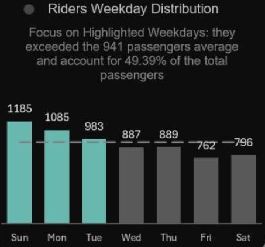

# 🚍 This Project Started With a Simple Question: Are Buses Being Used Efficiently?
---
## 🖼️ Dashboard Preview
---
What looks like routine transport data often hides patterns you don’t expect.  
After analyzing two months of ridership data, it became clear that demand doesn’t always follow assumptions — some days are far busier than expected, others surprisingly quiet.

This **Bus Transportation Analytics Dashboard**, built entirely in **Microsoft Excel**, translates raw transport data into clear, refresh-ready insights to support better routing, scheduling, and fleet decisions.


---

## 🔍 Business Questions Answered

This project analyzes **bus ridership and operational performance** using a fully automated Excel dashboard.

The objective was to:
- Understand how demand varies by **route, time, and day**
- Identify **over- and under-utilized routes**
- Surface trends that impact operational efficiency

- Analyze demand patterns across **routes, time periods, and days**
- Identify **busiest and least-utilized routes** to highlight capacity imbalances
- Determine **peak and off-peak operating hours** to understand congestion trends
- Evaluate **year-over-year performance changes** to uncover patterns and improvement opportunities
- Surface insights that directly impact **operational efficiency and planning**

All data processing, modeling, and visualization were completed in Excel using Power Query, Power Pivot, PivotTables, and DAX. New data can be added and refreshed without rebuilding the dashboard.

---

## 📌 Key Metrics at a Glance

- **Total passengers:** 6,587 *(two-month period)*  
- **Average riders per trip:** 33  
- **Most popular route:** East–West Express  
- **Least popular route:** South Line *(nearly 10× less busy than East–West Express)*  
- **Peak travel time:** 20:57  
- **Month-over-month change:** **–83.5%**, likely due to seasonal or holiday variations 
- **Riders traveling on specific weekdays:** 49.4%  
- **Day-wise ridership extremes:** Sundays highest with 1,185 passengers; Fridays lowest at 762 passengers

**Some routes hustle. Some coast. The data makes that distinction very clear.**

---

## 🧠 Why This Dashboard Matters

Insights from this analysis can help organizations:

- Optimize routes based on real demand
- Balance fleet usage more effectively
- Reduce unnecessary or low-value trips
- Improve service efficiency and rider experience
- Support planning with evidence rather than assumptions

---

## 🛠️ Tools Used

- Microsoft Excel  
- Power Query (data transformation & automation)  
- Power Pivot (data modeling)  
- DAX (calculated measures & KPIs)  
- PivotTables & PivotCharts  
- Dashboard design & data storytelling  

---

### 📸 Individual Visuals

1.**KPIs**

This section summarizes the key metrics at a glance: total passengers over the two-month period, average riders per trip, and the busiest and least utilized routes. These KPIs provide a quick overview of overall system performance and help identify immediate areas for operational focus.


2.**Total Riders Yearly Distribution**

This chart shows cumulative ridership across the year, allowing us to visualize trends over time and spot seasonal fluctuations. It highlights how total passengers accumulate month by month, providing insights into overall demand patterns and planning for capacity needs.


  
3.**Day-wise ridership (Sunday vs Friday)**

This comparison highlights differences in ridership across days of the week, with a focus on Sundays and Fridays. Sundays emerge as the busiest day, while Fridays are significantly quieter, helping planners understand day-specific demand and adjust scheduling accordingly.



4.**Peak vs off-peak time analysis**
  
Ridership is analyzed in five-hour intervals to identify peak and off-peak travel periods. This visualization makes it clear when buses are most crowded and when there is excess capacity, supporting more efficient route planning and fleet allocation.


5.**Bus utilization distribution** 
  
This chart shows bus utilization, with 58% under-utilized (38 buses), 30% over-utilized (20 buses), and 12% well-utilized (8 buses), providing a quick view of operational efficiency and routes needing optimization.


---

## 🎯 Learning Outcomes

- Designed a fully automated Excel analytics workflow  
- Built a scalable star schema in Power Pivot  
- Used DAX to translate business logic into metrics  
- Strengthened analytical storytelling through visualization  
- Gained deeper insight into transport demand behavior  

---

📌 *This project demonstrates how Excel, when used thoughtfully, can uncover operational insights hiding in everyday data.*

---

## 📁 Repository Structure
```text
Hospital-ER-Dashboard-PowerBI/
│
├── 📁 dataset/
|     ├── Dim_buses.csv
|     ├── Dim_demographics.csv
|     ├── Dim_routes.csv
|     └── Facttable_ridership.csv
|
├── 📁 screenshots/
│     ├── Bus Utilization Rate.png
│     ├── KPIs.png
│     ├── Total Passengers by Time.png
|     ├── Weekly Distribution.png
|     └── YoY Change.png
|
├── Bus Transporatation Dashboard.xlsm
|
├── Bus Transporatation Dashboard.jpeg
|
└── README.md

```

## ⭐ Acknowledgment
Inspired by the **Data with Decision** YouTube channel and created as a learning-focused portfolio project to strengthen Excel dashboard skills.

## 📬 Connect with me 

👩‍💻 **Created by:** Ramsha Arshad 

🔗 www.linkedin.com/in/ramshaarshad 

✉️ email: ramsha_arshad467@hotmail.com

⭐ *If you find this project helpful, feel free to star the repository!*
